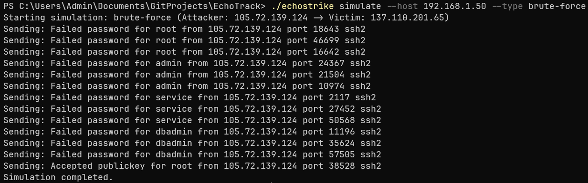
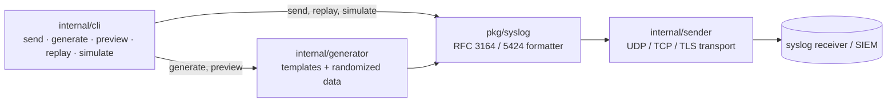
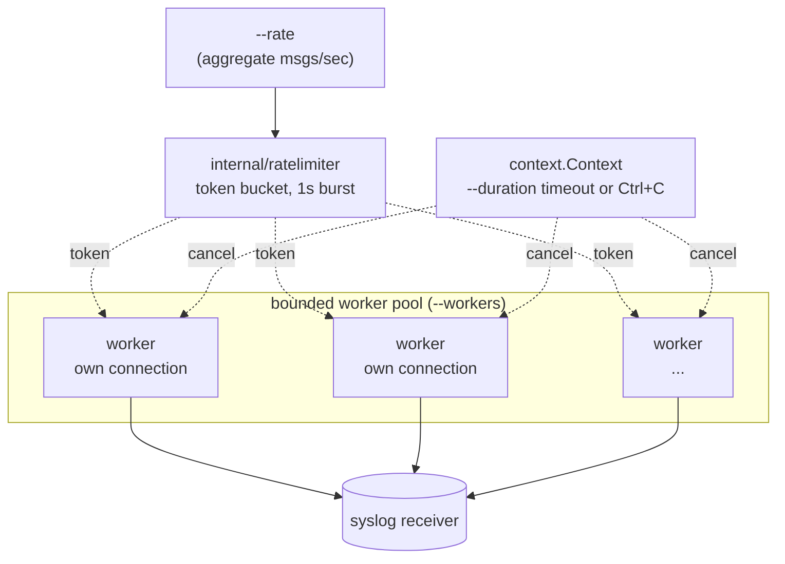

# EchoStrike

[](https://dl.circleci.com/status-badge/redirect/circleci/3bh1VHXW7Jnh7tss7AKSLR/4057bbec-2b94-4117-9db6-3a85206674ea/tree/main)

> **Syslog Attack Simulation & Traffic Generation**



## Why EchoStrike?

**I built** a specialized tool to generate high-fidelity Syslog traffic because testing security tools shouldn't require waiting for real attacks.

**I use it** to verify that SIEMs (like Splunk, Elastic, Sentinel) and detection pipelines are working correctly. It ensures your alerts fire when they should, without the risk of running actual malware.

**It works** by combining a **Randomization Engine** with a low-level **Network Sender**. `generate` fans sends out across a bounded worker pool. Each worker holds its own long-lived connection instead of dialing per message and throttled by a shared token-bucket rate limiter, so the aggregate send rate matches `--rate` regardless of how many workers are running. This lets you generate varied, realistic log lines (varying IPs, users, timestamps) and send them concurrently over UDP, TCP or TLS to load-test your infrastructure.

EchoStrike is a single-binary CLI tool designed for security professionals, Red Teamers and Detection Engineers. It generates realistic syslog traffic, simulates attack patterns and load-tests SIEM pipelines with concurrent log ingestion.

## Features

### Core Capabilities (Implemented)

- **Multi-Protocol Support**: Send logs via UDP, TCP or TLS.
- **RFC Compliance**: Full support for RFC 3164 (BSD) and RFC 5424 (IETF) message formats.
- **Attack Simulation**: Automated brute-force and port-scan log patterns (`simulate` command).
- **Concurrent Generation**: `generate` uses a bounded worker pool with a shared rate limiter (`--rate`) and configurable concurrency (`--workers`), each worker reusing one connection for its lifetime.
- **Randomized Templates**: Built-in `text/template`-based log templates (SSH, nginx, firewall) with randomized IPs/users/ports (`internal/generator`).
- **Replay Mode**: Replay existing log files with `replay` command.
- **Dry Run**: Preview logs formatting with `preview` command.
- **Zero-Dependency**: Static Go binary, runs anywhere.
- **Docker Support**: Includes Dockerfile for easy containerization.
- **Tested**: Unit tests across the syslog formatter, generator, sender, and rate limiter, run on every push via GitHub Actions.

### Planned Features (Coming Soon)

- **Jitter & Randomization**: More advanced variations in timestamps and user agents.
- **Timestamp-accurate replay**: `replay --preserve-timing` currently applies a fixed delay between lines rather than reproducing the original inter-arrival timing.

## Installation

### From Source

Requires Go 1.25.6+ (see `go.mod`):

```bash
git clone https://github.com/jomboi8/echostrike.git
cd echostrike
go install ./cmd/echostrike
```

### Run Directly

```bash
go run cmd/echostrike/main.go [command] [flags]
```

## Usage

### Basic Sending

Send a single test message to a local syslog server over UDP:

```bash
echostrike send --host 127.0.0.1 --port 514 --message "User 'admin' failed login from 192.168.1.50"
```

### Advanced Protocol & Formatting

Send via TCP using the modern RFC 5424 format with a custom app tag:

```bash
echostrike send \
  --proto tcp \
  --format rfc5424 \
  --tag sshd \
  --message "Accepted publickey for root from 10.0.0.5 port 55412 ssh2"
```

### Secure Transmission (TLS)

Send over TLS (skips verify for self-signed certs by default):

```bash
echostrike send --proto tls --host syslog.corp.local --port 6514 --message "Secure audit event"
```

### High-Volume Generation

Send 500 logs/sec for 30 seconds using 16 concurrent workers:

```bash
echostrike generate --host 127.0.0.1 --port 514 --template ssh-failed --rate 500 --duration 30s --workers 16
```

`--workers` defaults to `min(rate, 32)` if unset. `--rate` is the aggregate target across all workers, enforced by a shared token-bucket limiter — adding workers increases concurrency, not the rate. Ctrl+C stops the run cleanly at any point.

### Docker Usage

Build the container:

```bash
docker build -t echostrike .
```

Run a simulation via Docker:

```bash
docker run --rm echostrike simulate --type brute-force --host 192.168.1.50
```

## Architecture

EchoStrike is built with a modular architecture to support concurrent traffic generation and extensibility:



### Concurrent `generate` pipeline

`generate` is the one command where throughput matters, so it's the one built around a bounded worker pool instead of a single loop: each worker owns a persistent connection for its lifetime, a shared token-bucket limiter caps the *aggregate* send rate across every worker, and a single `context.Context` cancels the whole pool cleanly on `--duration` timeout or Ctrl+C.



- **`cmd/echostrike`**: The CLI entry point, built with `Cobra` for robust flag handling.
- **`internal/cli`**: Command definitions (`send`, `generate`, `preview`, `replay`, `simulate`).
- **`internal/sender`**: Handles the network transport layer. It abstracts TCP/UDP/TLS connections; each concurrent worker owns and reuses its own connection.
- **`internal/ratelimiter`**: A small token-bucket limiter shared across `generate`'s worker pool, so the aggregate send rate holds regardless of worker count.
- **`internal/generator`**: The engine responsible for hydrating `text/template` templates with randomized data (IPs, usernames, ports) to create realistic log lines.
- **`pkg/syslog`**: A standalone RFC-compliant formatter. It ensures messages are strictly formatted according to syslog standards (RFC 3164/5424) before transmission.

## Testing

```bash
go build ./...
go vet ./...
go test ./... -race -cover
```

All of the above run on every push/PR via [CircleCI](.circleci/config.yml). A GitHub Actions equivalent also ships in [`.github/workflows/ci.yml`](.github/workflows/ci.yml), set to manual (`workflow_dispatch`) trigger for now since hosted-runner billing isn't currently available on this account.

## Contributing

Pull requests are welcome! I am currently looking for contributions in:

- **Template Packs**: Real-world log samples for various services (AWS, Cisco, Linux Auth).
- **Attack Scenarios**: Logic to generate multi-stage log sequences (e.g., failed login -> successful login -> sudo usage).

## License

[MIT](LICENSE)
